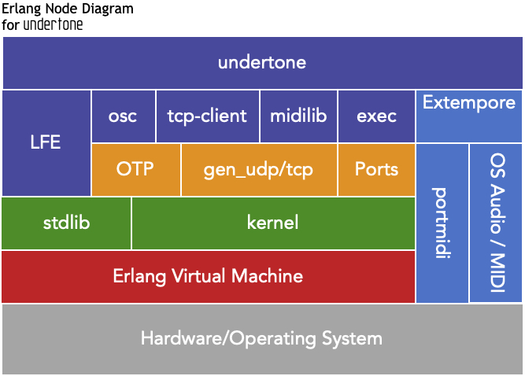
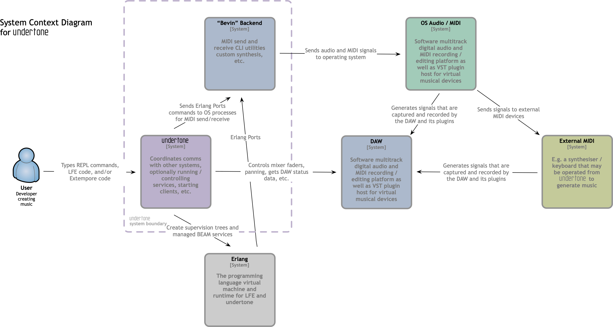
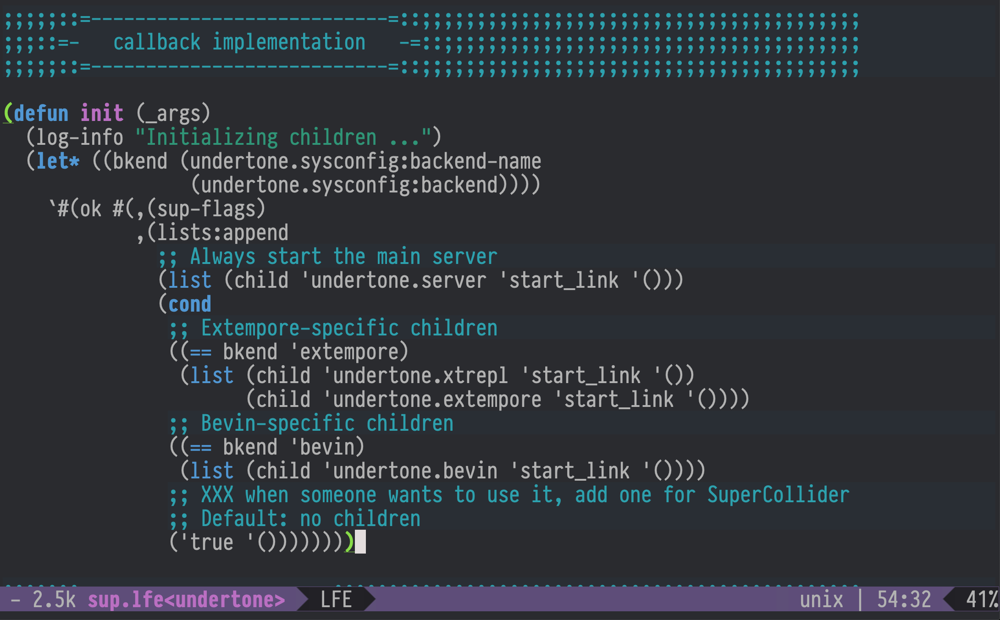

+++
title = "Sound on BEAM: Music in the Land of Distributed Lisp"
outputs = ["Reveal"]

[logo]
src = "logo-v6.svg"
+++

# Sound on BEAM: Music in the Land of Distributed Lisp

[//]: Speaker-Notes:
{}

Hello, and welcome!

My name is Duncan McGreggor -- today I'm giving the second half of the talk
that I gave at Lambda Days, just a few weeks ago.

{}

---

# ( Part II )

[//]: Speaker-Notes:
{}

As with that one, I'm going to share with you a little Lisp Flavoured Erlang,
Extempore, and generative music. 

However, in this talk I will be focusing much more upon the details of
the undertone project itself, from the perspective of both a musician
and an engineer ...

{}

---

## Overview

* Introduction
* undertone and Its Use Cases
* Architecture
* Supervision Trees
* Clients and Servers
* External Processes, Ports, and `exec`
* Languages
* A Custom REPL
* Demo / Performance / Walkthrough
* What's Next for undertone
* Q & A

[//]: Speaker-Notes:
{}

... in particular, the need for a reliable soft real-time
system capable of speaking multiple protocols, of creating servers or 
connecting to them, and of being able to continue operations, even
as parts of the system encounter unrecoverable errors and must be restarted.

{}

---

## Who am I?

* Prinicpal software engineer
* Life-long hacker (started at age 9 in '81; never stopped)
* Habbitual explorer
* Core contributor to Robert Virding's Lisp Flavoured Erlang (LFE)

[//]: Speaker-Notes:
{}

Here are some superficial bullet points about me ...

{}

---

## Who am I?

* 4 yo - Messing about with Piano
* 9 or 10 yo - Formal piano lessons, casual guitar
* 14 yo - First synthesizer (analog Korg PolySix)
* 16 yo - Performed in a chamber music group
* 25 yo - Stopped music; replaced with physics/maths ... then career
* 42 yo - Began exploring generative music
* 48 yo - Started playing seriously again

[//]: Speaker-Notes:
{}

... and some more, relating to music.

If I can draw your attention to the end of that list --

About 6 1/2 years ago at OSCON 2014 ...

{}

---


## Re-entering the Musical World


{}

... I met Andrew Sorensen -- pictured here -- after his Extempore live-coding performance keynote.

(And yeah, that's me -- the one nearest him).

Andrew and I talked about live coding including my interest in using LFE/OTP along with Extempore.

{}

---

## Re-entering the Musical World


{}

I believe he also mentioned previous conversations between himself and Joe Armstrong about Extempore and Erlang -- including some possibilities for collaboration.

I started using Extempore immediately after Andrew's performnace, when he shared his keynote code with me. Yet life pulled me in other directions.

Last year, however, I picked it up again ...

{}

---

## Re-entering the Musical World

 

{}

... after Aleksander Lisiecki's blog post which covered sound generation in Erlang.

I ported his code to LFE, and sufficiently re-inspired, proceeded to create the undertone project.

---

## Wherefore undertone?

 

{}

undertone came about due to my need to control synthsizers -- both hardware and software -- and run services. For all the separate systems I wanted to manage, a BEAM language felt like the perfect match.

I started by reading everything I could on Erlang and music, retracing Joe Armstrong's steps from the mid-2000s up until a few short years ago. 

{}

---

## Wherefore undertone?

 

{}

As such, one of the first features that landed in undertone was support for Open Sound Control (or OSC). This allowed me to run several of Joe's code samples from within a structured project using a custom backend for SuperCollider.

Ultimately, though, I became frustrated by my admittedly subjective perception that SuperCollider seems to lack an element of musicality -- a feeling that echoed my previous experiences with it.

{}

---


## Wherefore undertone?

 

{}

Remembering my wonderful experience with Extempore, I turned there next.

Within a few days I'd added a new backend for it in undertone, one that allowed me to run Extempore code from LFE.

{}

---

## Wherefore undertone?

 

{}

The real "why" behind undertone isn't a battle of backends, though ...

the heart of the matter is what I wanted to do with it.

In my practice sessions with guitar and synthesizers, I wanted to be able to quickly write just a few lines of code for some ambient backing sounds, or chord progressions against which I could practice scales, or experiment with intervals and counterpoint.

{}

---

## Wherefore undertone?

 

{}

After so long in the software industry, I'm just much, much faster at writing code than sitting down with a sheaf of blank staves and writing notes. So it needed to be a language in which I had fluency.

And, if I'm going to be writing code in my spare time, it needed to be a language that I love and have fun using. Ergo, LFE.

{}

---

## Wherefore undertone?

* Create music in my preferred language
* Monitoring and automatically restarting OS processes
* Speak to Open Sound Control servers (i.e., controlling faders on software consoles/mixers)
* Potentially host my own OSC servers
* Send TCP packages to the Extempore compiler service
* Automtically reconnect (with backoff support) to required services
* Be able to restart any of these components in the event of partial or complete system failure

{}

Above and beyond that, I needed to be able to control external processes running on the operating system, restarting them as necessary.

There are a lot of features listed here, but that one was biggie for me -- having run into it early on:

I did a lot of experimentation with different MIDI drivers, software synthesizers, VST plugin hosts, and ended up having various applications or their supporting processes, crash.

{}

---

## Wherefore undertone?

* Create music in my preferred language
* Monitoring and automatically restarting OS processes
* Speak to Open Sound Control servers (i.e., controlling faders on software consoles/mixers)
* Potentially host my own OSC servers
* Send TCP packages to the Extempore compiler service
* Automtically reconnect (with backoff support) to required services
* Be able to restart any of these components in the event of partial or complete system failure

{}

Sometimes days of work -- where I'd invested my time in a long chain of trial and error -- were lost. All because just one component I'd been experimenting with was unstable or wasn't designed to do the crazy things I was asking of it.

And to that point ...

{}

---

## Wherefore undertone?

Also:

* Maintain multiple, separate state contexts
* Support a familiar workflow (a REPL!)
* Provide basic session management (ETS + a handful of functions)

{}

I also needed to manage state in a sane manner. As you are all assuradly well aware, the points above and those in the previous slide are features readily available in OTP and those BEAM languages which offer Erlang interoperability.

It is for all these reasons that undertone was born, created in LFE, and built upon the foundation of Erlang and OTP.

{}

---



## What is undertone?

 

{}

undertone is an idea and a set of needs which depend upon multiple systems in order to realise the goal of making music reliably.

Here is a now-classic BEAM depcition of the undertone stack.

{}

---

## Architecture


[//]: Speaker-Notes:
{}

And here is a diagram that is perhaps a bit more useful: a view of the system configured to use the Extempore backend, with all of the high-level communications involved.

{}

---

## Architecture

System context for Extempore:

* talks to the OS / routes MIDI
* signals routed to external devices
* also routed to MIDI in the DAW (e.g., software synthesizers)

[//]: Speaker-Notes:
{}
Extempore runs a TCP server to which we can connect, and then from there, gain access to the operating system's audio layer, MIDI devices, and the like.
{}

---

## Architecture

System context for undertone:

* uses Erlang (starts up supervision tree, clients, servers)
* talks to Extempore (bitstrings over TCP)
* controls OSC servers (e.g., DAWs)

[//]: Speaker-Notes:
{}
undertone spawns the `extmpore` binary as a managed OS process, starts a TCP client, and optionally starts Open Sound Control clients and servers.

All of these goe into a supervision tree that will restart these components, should one or more of them be pushed beyond their limits -- all without crashing the Erlang VM.

{}

---

## Architecture


[//]: Speaker-Notes:
{}

In addition to Extempore support ...

{}

---

## Architecture



[//]: Speaker-Notes:
{}

I'm working on a new backend using two CLI tools created by the head of software engineering at Moog: Geert Bevin. These are Erlang ports opened to long running OS processes.

I had hoped to have this ready to show you today, but I instead chose to create a new demo using a sampled grand piano, which you'll be hearing in a few minutes.
{}

---

## Architecture


[//]: Speaker-Notes:
{}

Back to the Extempore backend:

If we zoom in on the section ...

{}

---



## Architecture


[//]: Speaker-Notes:
{}

... within the dashed purple border ...

{}

 
---
 
## Architecture


[//]: Speaker-Notes:
{}
We can see a little more of how undertone pulls systems together.

This particular view of the architecture shows which undertone LFE and OTP components are connected to each other and how.
{}

---



## Architecture


[//]: Speaker-Notes:
{}
The grey box in the middle-right is what you will being seeing during the demo.

It represents a custom Extempore REPL -- written in LFE -- that has its own commands that are separate from the LFE REPL. 

{}

---



## Architecture


[//]: Speaker-Notes:
{}

Note that everything within the purple dashed boundary except the Extepore component, has been written in LFE.

{}

---

## Architecture

The undertone "container":

* OTP app with supervisor and state server
* State server for mananging session commands and system config
* OSC clients for any OSC-enabled software running a UDP server
* TCP client for long-running connections to Extempore
* LFE REPL
* Extempore REPL

[//]: Speaker-Notes:
{}

Here's a quick textual summary of all those diagrams ...

{}

---

## Progress Check

* ✅ Introduction
* ✅ undertone and Its Use Cases
* ✅ Architecture
* Supervision Trees
* Clients and Servers
* External Processes, Ports, and exec
* A Custom REPL
* Demo / Performance / Walkthrough
* What's Next for undertone
* Q & A

{}

And here's a reminder on what we've covered so far ...

{}


---

## Supervision Trees


[//]: Speaker-Notes:
{}

Now let's take a closer look at undertone's supervision tree.

This is of special importance for undertone, since it is the core of what undertone uniquely offers to the world of programmatic and generative music.

{}

---

## Supervision Trees



[//]: Speaker-Notes:
{}

Here's the current undertone supervisor `init` function.

Based upon OTP release configuration`sys.config` values, the appropriate child processes will be created, some specific to a backend.

This is, of course, easily extendable to any backend or other related service which might be needed in the future.

{}

---

## Supervision Trees


[//]: Speaker-Notes:
{}

When undertone is run with the Extempore backend, it supervises:

1. the general undertone server common to all backends 
2. a server specific to the Extempore backend
3. and then an additional server that manages the Extempore REPL sessions

The backend-specific server then opens an Erlang port to manage the OS process in which the Extempore binary is running.

{}

---

## Supervision Trees


[//]: Speaker-Notes:
{}

Things are a little different for the "Bevin" backend:

* while there's still the general server
* and a backend-specific server

There's no custom REPL. This backend doesn't have its own language, unlike Extempore, so we don't need one: we get to use the regular LFE REPL.

Also, there are _two_ OS processes for the separate binaries which comprise this backend: A MIDI tool for sending MIDI messages, and another for receiving them.

{}

---

## Clients and Servers

* Extempore client
  * TCP client for sending messages to the compiler server
  * Scheme syntax as bitstrings
  * Started by the release

[//]: Speaker-Notes:
{}

I'm running short on time, and want to leave enough room for the demo and walk-through ...

{}

---

## Clients and Servers

* Open Sound Control clients
  * potentially many
  * connecting to both software and hardware
  * e.g., digital audio workstations (DAWs) to control console faders

[//]: Speaker-Notes:
{}

So I will breeze past these slides.

{}

---

## Clients and Servers

* Open Sound Control servers
  * none right now
  * could create an OSC/MIDI bridge in LFE/Erlang 
  * create a custom Raspberry Pi sound device and export OSC methods
* erlsci/osc is UDP only

[//]: Speaker-Notes:
{}

They simply give more details about the types of clients and servers used in undertone ...


{}

---

## Clients and Servers

* `gen_servers` for state management
* The Extempore REPL is a simple looping server
* The undertone backends each have their own `gen_server` that's responsible for managing the backend

[//]: Speaker-Notes:
{}

... It's all standard fare, though -- nothing too remarkable. I can cover any questions around these during the Q & A.

{}

---

## External Processes & Erlang Ports

* Previously used `erlang:open_port` (`spawn_executable`)
* Switched to `exec` library (which still uses Erlang ports)
* Extempore backend:
  * capturing output from Extempore
* "Bevin" backend:
  * sending MIDI (OS process)
  * receiving MIDI (separate OS process)
  * stdout is captured for both and logged / parsed

[//]: Speaker-Notes:
{}

I do want to pause here, though:

Of all the languages where I have had to utilise their support for inter-process
communication or reading from and writing to pipes, every single one was
a bit painful -- with the notable and laudable exception of Erlang.

{}

---

## External Processes & Erlang Ports

* Previously used `erlang:open_port` (`spawn_executable`)
* Switched to `exec` library (which still uses Erlang ports)
* Extempore backend:
  * capturing output from Extempore
* "Bevin" backend:
  * sending MIDI (OS process)
  * receiving MIDI (separate OS process)
  * stdout is captured for both and logged / parsed

[//]: Speaker-Notes:
{}

As much as I love OTP and regale non-BEAM programmers with the virtues of
its behaviours and callbacks, on the undertone project I have become
deeply enamored with Erlang ports. Though I've used them before, this is
the first time they have formed the very basis of a project, and working
with them has been a delight.

{}

---

## External Processes & Erlang Ports

* Previously used `erlang:open_port` (`spawn_executable`)
* Switched to `exec` library (which still uses Erlang ports)
* Extempore backend:
  * capturing output from Extempore
* "Bevin" backend:
  * sending MIDI (OS process)
  * receiving MIDI (separate OS process)
  * stdout is captured for both and logged / parsed

[//]: Speaker-Notes:
{}

That being said, there are some problems one encounters when shutting down
an OTP application that has spawned long-running executables. And, to be
fair, managing the lifetime of an OS process is arguably not the purview
of a simple, low-level library.

{}

---

## External Processes & Erlang Ports

* Previously used `erlang:open_port` (`spawn_executable`)
* Switched to `exec` library (which still uses Erlang ports)
* Extempore backend:
  * capturing output from Extempore
* "Bevin" backend:
  * sending MIDI (OS process)
  * receiving MIDI (separate OS process)
  * stdout is captured for both and logged / parsed

[//]: Speaker-Notes:
{}

Fortunately, the erlexec project does support this, and with an API that
is just as simple to use as Erlang ports. And erlexec itself uses ports.

{}

---

## Dependencies

* https://github.com/saleyn/erlexec
  * Addresses issues with terminating OS processes
  * Keeps to the spirit of Erlang's clean Port API
  * Used to manage 2 of 3 backends in undertone

[//]: Speaker-Notes:
{}

Which brings me to something else I wanted to call out: special mention for a few of the key dependencies upon which undertone relies.

{}

---

## Dependencies

* https://github.com/erlsci/osc
  * Forked from https://github.com/marianoguerra/erlang-osc
  * 5-10 year old code, updated per rebar3 project best practices

[//]: Speaker-Notes:
{}

And without which the task of realising the vision of the undertone
project would have taken much more time ...

{}

---

## Dependencies

* https://github.com/lfex/tcp-client
  * Originally used https://github.com/cabol/tcp_client
  * Abandoned that effort in favour of an implementation based upon `gen_statem` using https://andrealeopardi.com/posts/connection-managers-with-gen_statem/
  * Written in LFE

[//]: Speaker-Notes:
{}

Or might simply have made the prospect of it too daunting.

Side note: Andrea's blog post is one of the best demonstrations for `gen_statem` I've yet encountered.

{}

---

## Dependencies

* https://github.com/ferd/backoff
  * A readily available and easy to use exponential backoff library

[//]: Speaker-Notes:
{}

And a special mention of juse one of the very many contributions by Fred to the Erlang ecosystem.

{}

---

## Progress Check

* ✅ Introduction
* ✅ undertone and Its Use Cases
* ✅ Architecture
* ✅ Supervision Trees
* ✅ Clients and Servers
* ✅ External Processes, Ports, and exec
* Languages
* A Custom REPL
* Demo / Performance / Walkthrough
* What's Next for undertone
* Q & A

{}

Aaaaand another update on the ground we've covered so far ...

{}

---



## Erlang & LFE


Basics: a recursive function using pattern-matching in the function heads.

#### Erlang

```erlang
ackermann(0, N) ->
  N+1;
ackermann(M, 0) ->
  ackermann(M-1, 1);
ackermann(M, N) ->
  ackermann(M-1, ackermann(M, N-1)).
```

#### LFE

```clj
(defun ackermann
  ((0 n) (+ n 1))
  ((m 0) (ackermann (- m 1) 1))
  ((m n) (ackermann (- m 1) (ackermann m (- n 1)))))
```

[//]: Speaker-Notes:
{}

It would be a shame to give a BEAM talk without actually doing a dialectical comparison, so here is something for those who have not seen any LFE before:

This is some syntax in Erlang and LFE for function-head pattern-matching and recursion.

{}

---

## Erlang & LFE

OTP: Erlang `supervisor`

```erlang
-module('undertone.sup').
-behaviour(supervisor).
-export([start_link/0]).
-export([init/1]).

start_link() ->
    supervisor:start_link({local, ?MODULE}, ?MODULE, []).
    
init([]) ->
    {ok, {sup_flags(),
          [child('undertone.server', start_link, [])]}}.
    
sup_flags() ->
    #{strategy => one_for_one,
      intensity => 3,
      period => 60}.
```

[//]: Speaker-Notes:
{}

For a comparison of slightly more involved code, here is a partial implementation of the iconic OTP supervisor in Erlang.

{}

---



## Erlang & LFE

OTP: LFE `supervisor`

```clj
(defmodule undertone.sup
  (behaviour supervisor)
  (export
   (start_link 0)
   (init 1)))
   
(defun start_link ()
  (supervisor:start_link `#(local ,(MODULE)) (MODULE) '()))

(defun init (_args)
  `#(ok #(,(sup-flags)
          (,(child 'undertone.server 'start_link '())))))
  
(defun sup-flags ()
  `#m(strategy one_for_one
      intensity 3
```

[//]: Speaker-Notes:
{}

And the same in LFE.

Back to undertone:

When using the Extempore backend, there are another two languages to consider, both derivations of Scheme ...

{}

---

## Extempore

xtlang:

``` scheme
(bind-func AudioBuffer_data_b64
  (lambda (ab:AudioBuffer*)
    (let ((b64size:i64 0)
          (datsize:i64 (* (AudioBuffer_frames ab)
                          (AudioBuffer_channels ab) 4)))
      (String (base64_encode (cast (tref ab 4) i8*)
                             datsize
                             (ref b64size))))))
```

[//]: Speaker-Notes:
{}

This is Extempore's xtlang, which provides low-level access to all aspects of the Extempore system, essentially a thin Scheme layer over Extempore's low-level C code.

{}

---

## Extempore

Scheme:

``` scheme
(sys:load "libs/external/portmidi.xtm")
(pm_initialize)
(define *midi-out* (pm_create_output_stream 3))

(define midi-loop
  (lambda (beat dur)
    (mplay *midi-out*
           (random (list 36 43 48 51 60 60 60 67 70 74 75))
           (random 60 80)
           dur 0)
    (callback (*metro* (+ beat (* .5 dur)))
              'midi-loop
              (+ beat dur)
              dur)))

(midi-loop (*metro* 'get-beat 4) 1/4)
```

[//]: Speaker-Notes:
{}
And this is Extempore's higher-level language, a derivative of TinyScheme.

This is what most Extempore performers use -- and is what you'll see me using in the custom REPL during the demo.
{}

---

## A Custom REPL

 

[//]: Speaker-Notes:
{}

One of the benefits of using undertone with the Extempore backend is the
REPL it provides for Extempore.

{}

---

## A Custom REPL

 

[//]: Speaker-Notes:
{}

Extempore proper, doesn't actually have a REPL of its own -- the standard way of interacting with it is by means of a text editor such as Emacs or VS Code which are  capable of sending Scheme forms to the Extempore TCP server for on-the-fly compilation.

Calling the `start` function, as pictured here, is how one enters this
REPL.

{}

---

## A Custom REPL

 

[//]: Speaker-Notes:
{}

One may type the `(help)` function to display the
list of possible commands.

{}

---

## A Custom REPL

 

[//]: Speaker-Notes:
{}

And the `(sess)` command displays an indexed
list of all Extempore forms and REPL commands entered during
the given session.

Additional commands are available for re-running one or more of the previous
entries in this list.

{}

---



## A Custom REPL

 

[//]: Speaker-Notes:
{}

A final note on this topic: The Extempore REPL was implemented in LFE using the classic approach invented
by members of the Lisp community in the early 1960s:

read-eval-print and loop :-)

{}

---

## Demo!

[//]: Speaker-Notes:
{}

Okay, time for the demo!

A note of caution, though: here there be dissonance! Sometimes for effect, and sometimes by unhappy accident. Due to the ramdom nature of generative music every performance is different -- often _very_ different.

The key thing to keep in mind while listening is to think of the _possibillties_ of what can be done, not the limitations of a given performance :-)


Without further ado ...

{}

---

## Demo!

[//]: Speaker-Notes:
{}

There are two parts to the demo I will be giving you:

1. The first is a recording comprised of piano adaptation for what was originally a piece for banjo and orchestra. This is then used as the basis in some generative techniques utilising Markov chains for control of chord progressions, melody generation, volumes, and sustain.
2. After that is the second part, which walks through those generative techniques.

Without further ado ...

{}

---

## Demo

Hi-res video of demo available here:

https://www.youtube.com/watch?v=neSGoz2F1d8

[//]: Speaker-Notes:
{}

If you experienced any network dropout or if the sound quality over Zoom was not
to your liking, you can view the demo on YouTube at this link.

{}

---

## What's Next for undertone?

 

[//]: Speaker-Notes:
{}
So what's next for undertone?

I have created project tickets for efforts such as:

* Finishing the new MIDI-only, "Bevin" backend
* Deeper support of Extempore in native LFE
* Live capture of music, recorded as LFE data structures
* Digital Signal Processing from LFE
* More support for open source synthesizers
* Exploring the collaboration possibilities with the distributed platform that LFE offers
* Lots of practical use in generating music, music theory, etc. ... 
* And just making long-form pieces for the pure enjoyment of _listening!_
{}

---

## Progress Check

* ✅ Introduction
* ✅ undertone and Its Use Cases
* ✅ Architecture
* ✅ Supervision Trees
* ✅ Clients and Servers
* ✅ External Processes, Ports, and exec
* ✅ Languages
* ✅ A Custom REPL
* ✅ Demo / Performance / Walkthrough
* ✅ What's Next for undertone
* Q & A

{}

And, for the sake of completeness, here are the checked-off topics.

{}

---

## Credits

[Ent drawing](https://talbotjenkins.wixsite.com/talbotjenkins/miscellaneous?lightbox=dataItem-jpkmxxse) by Talbot Jenkins.

<br />

Beginnig of first piece in demo adapted for Piano, based upon "Journey of the Sorcerer" by Bernie Leadon of The Eagles.


[//]: Speaker-Notes:
{}

Special thanks to the Ent artist and for the original creator and performers of the Hitchhiker's Guide to the Galaxy theme.

{}

---

#### Contact

* oubiwann@gmail.com
* [@oubiwann]()
* https://soundcloud.com/oubiwann/tracks
* [linkedin.com/in/oubiwann]()
* [@forgottentones]()
* https://soundcloud.com/forgotten-tones/tracks

[//]: Speaker-Notes:
{}

Once the talk slides are published, you can visit these project-related links ...

{}

---

#### undertone Resources

* https://github.com/ut-proj/undertone
* https://undertone.lfe.io/presentations
* https://undertone.lfe.io/book
* [lfe.slack.com]() #algo-sound
* http://groups.google.com/group/lfe-undertone
* [@lfeundertone]()
* https://www.instagram.com/lfeundertone/

[//]: Speaker-Notes:
{}

and ...

{}

---

#### LFE Resources

* https://lfe.io/
* https://github.com/rvirding/lfe
* [lfe.slack.com]()
* http://groups.google.com/group/lisp-flavoured-erlang
* [@ErlangLisp]()


[//]: Speaker-Notes:
{}

with that ...

{}

---

## Q & A

[//]: Speaker-Notes:
{}

... I can field any questions you may have!

{}
