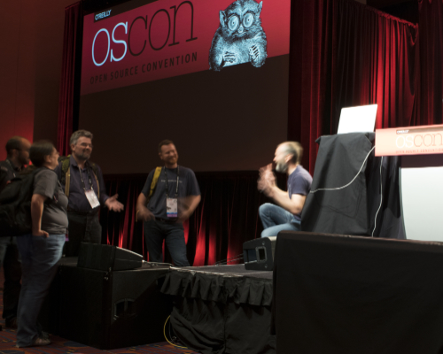
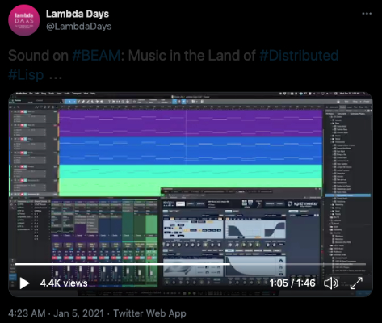
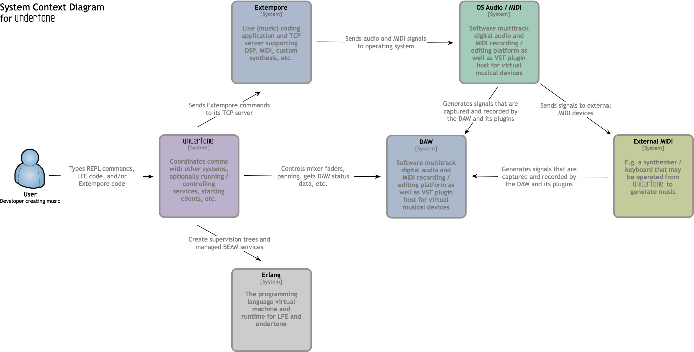
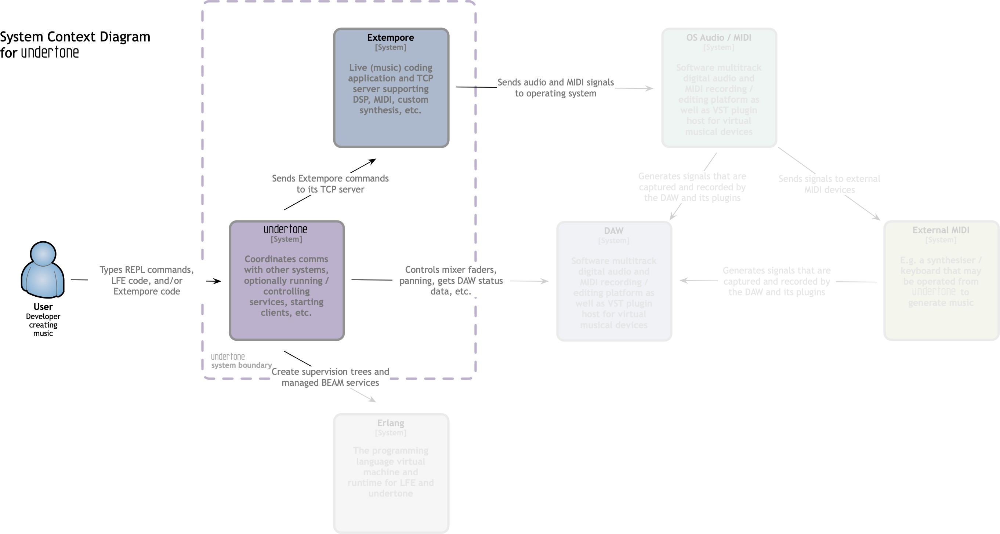
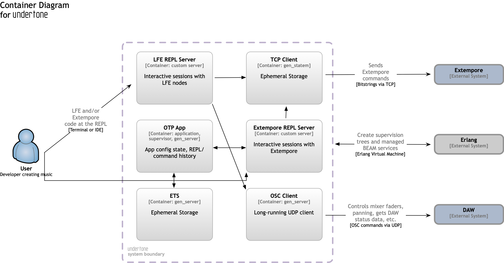
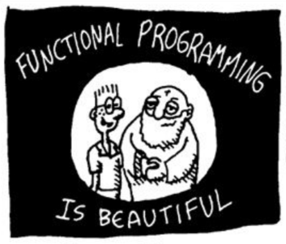

+++
title = "Sound on BEAM: Music in the Land of Distributed Lisp"
outputs = ["Reveal"]

[logo]
src = "logo-v6.svg"
+++

# Sound on BEAM: Music in the Land of Distributed Lisp

[//]: Speaker-Notes:
{}
Welcome to the talk!

My name is Duncan McGreggor, and today I'm going to share with you a little
of Lisp Flavoured Erlang, some Extempore, talk about music synthesis and
recording, and how they all come together in the undertone project.

{}

---

## Overview

* Introduction
* undertone, its architecture, and its uses
* Functional programming, mutable state, and I/O
* Intermission Q & A

[//]: Speaker-Notes:
{}

{}

---

## Overview

* Sound synthesis as functional programming
* Systems control for music
* Demo
* What's next for undertone
* Final Q & A

[//]: Speaker-Notes:
{}

{}

---

## Who am I?

* Prinicpal software engineer
* Life-long hacker (started at age 9 in '81)
* Habbitual explorer
* Core contributor to Robert Virding's Lisp Flavoured Erlang (LFE)

---

## Why am I talking about music?

* ❤️Maths (school)
* ❤️Functional Programming (career)
* ❤️Music (...)
* (& ❤️Lisp)

[//]: Speaker-Notes:
{}
The last musical performance I gave was as the pianist in a chamber music quartest when I was 17. 

In my 20s, I built a hobbyist home recording studio. This was the early-to-mid-90s, so everything was analog.
{}

---

## Why this topic?

 

{}
Then, when I was 42, I met Andrew Sorensen after his Extempore live-coding performance at OSCON 2014,
created a variation on his piece, and thus began a slow-reignition of my passion for music.

Now playing my two main instruments again, even taking courses.ss
{}

---

## What is undertone?



{}
In my 2021 Lambda Days "teaser" video some of you may have seen, there are 9 seperate tracks of synthesizer being played. All of those were generated by undertone.
{}

---

## What is undertone?

<ul>
<li>That music you heard? That.</li>
<li class="fragment">Sort of.</li>
<li class="fragment">Lots of software synthesizers, played via MIDI.</li>
<li class="fragment">Routed by Extempore.</li>
<li class="fragment">Over TCP.</li>
<li class="fragment">It's complicated.</li>
</ul>


{}
{}


---

## Architecture



[//]: Speaker-Notes:
{}
Here's a diagram of the system context for undertone.
{}

---

## Architecture

System context for undertone:

* uses Erlang (starts up supervision tree, clients, servers)
* talks to Extempore (bitstrings over TCP)
* controls OSC servers (e.g., DAWs)

[//]: Speaker-Notes:
{}
{}

---

## Architecture

System context for Extempore:

* talks to the OS / routes MIDI
* signals routed to external devices
* also routed to MIDI in the DAW (e.g., software synthesizers)

[//]: Speaker-Notes:
{}
{}

---

## Architecture


[//]: Speaker-Notes:
{}
Now, if we zoom in ...
{}

---

## Architecture



[//]: Speaker-Notes:
{}
... on undertone's purple box, or "container" ...
{}

 
---
 
## Architecture



[//]: Speaker-Notes:
{}
We can see a little more of what's going on under the bonnet.
{}

---

## Architecture

The undertone "container":

* OTP app with supervisor and state server
* State server for mananging session commands and system config
* OSC clients for any OSC-enabled software running a UDP server
* TCP client for long-running connections to Extempore
* LFE REPL
* Extempore REPL

[//]: Speaker-Notes:
{}
{}

---

## Aside: Extempore vs SuperCollider

[//]: Speaker-Notes:
{}
{}

---

## Ways to Use undertone

<ul>
<li>Controlling.</li>
<li class="fragment">Playing.</li>
<li class="fragment">And controlling.</li>
<li class="fragment">And more playing.</li>
</ul>


[//]: Speaker-Notes:
{}
Because once you can control your music devices programmatically, you can play them in new and different ways.
{}

---

## Personal interests in its use

* Long, slow looping music in given keys, but random notes or intervals
* Accompanyment for practice
  * Jam sessions
* Endless, non-repeating background, ambient music


[//]: Speaker-Notes:
{}
Since this is for fun, and the love of the art, I want to do it in a manner I will enjoy.
{}

---

## Intermission


[//]: Speaker-Notes:
{}
{}

---
 
## FP in an I/O World


[//]: Speaker-Notes:
{}
So why would someone go through all the effort to put a functional wrapper around so much I/O and global, mutable state?
{}

---

## FP in an I/O World

[//]: Speaker-Notes:
{}
Functional Programming meets musical composition:

* better (more disciplined) control over the control global environment

{}

---

## Synthesis as Functional Programming



[//]: Speaker-Notes:
{}
{}

---

## Synthesis as Functional Programming

[//]: Speaker-Notes:
{}
{}

---

## What Can undertone Do?

[//]: Speaker-Notes:
{}
{}

---

## Aside: Erlang & LFE

[//]: Speaker-Notes:
{}
{}

---

## Demo

Time for some space music!

[//]: Speaker-Notes:
{}
{}

---

## What's Next for undertone?

[//]: Speaker-Notes:
{}
{}

---

## Land of Lisp

Special thanks to Conrad Barski, M.D. <br />
for his kind permission in using images from his book in this talk.

Buy it! http://landoflisp.com/

[//]: Speaker-Notes:
{}
{}

---

## Q & A

[//]: Speaker-Notes:
{}
{}

---

#### Contact

*  oubiwann@gmail.com
*  [@oubiwann]()
*  [linkedin.com/in/oubiwann]()
*  [@forgottentones]()
*  https://soundcloud.com/forgotten-tones/tracks

[//]: Speaker-Notes:
{}
Here's how you can reach me ...
{}

---

#### LFE Resources

*  https://lfe.io/
*  https://github.com/rvirding/lfe
*  [lfe.slack.com]()
*  http://groups.google.com/group/lisp-flavoured-erlang
*  [@ErlangLisp]()

[//]: Speaker-Notes:
{}
Here's where stuff is ...
{}

---

#### undertone Resources

*  https://github.com/ut-proj/undertone
*  https://undertone.lfe.io/book
*  [lfe.slack.com]() #algo-sound
*  http://groups.google.com/group/lfe-undertone
*  [@lfeundertone]()
*  https://www.instagram.com/lfeundertone/

---

{}

## Overview

* Background, sound in the digital world, etc.
* Homage: Joe Armstrong's explorations
* Extempore vs. SuperCollider
* Lisp Flavoured Erlang 2.0
* Extempore in OTP
* Making Music

[//]: Speaker-Notes:
{}
{}

---

## Background (me)

* 4 yo - Messing about with Piano
* 8 yo - Started formal piano lessons, casual guitar
* 16 yo - Performed in a chamber music group
* 22 yo - Assembled a home recording studio
* 25 yo - Stopped playing music, replaced with physics / maths studies
* 48 yo - Started playing again

[//]: Speaker-Notes:
{}
{}

---

## Terminology

#### Algorithmic Composition

=?=

#### Generative Music

[//]: Speaker-Notes:
{}
{}

---

## Background (generative music)

<ul>
<li class="fragment">1957 - Max Mathews MUSIC-1 on the IBM 704</li>
<li class="fragment">(1958 - LISP, also on the IBM 704)</li>
<li class="fragment">1962 - Sekine & Hayashi on the TOSBAC</li>
<li class="fragment">1964 - Moog & Deutsch with prototype synthesizers; Don Buchla creates the first commercial analog sequencer on the Buchla 100</li>
<li class="fragment">1969 - Max Mathews GROOVE on a Honeywell DDP-24; Peter Zinovieff MUSYS on PDP-8s</li>
<li class="fragment">1971 - EMS releases first digital sequencer</li>
</ul>

[//]: Speaker-Notes:
{}
{}

---

## Background (generative music)

<ul>
<li class="fragment">1957 - Max Mathews MUSIC-1 on the IBM 704</li>
<li class="fragment">(1958 - LISP, also on the IBM 704)</li>
<li class="fragment">1962 - Sekine & Hayashi on the TOSBAC</li>
<li class="fragment">1964 - Moog & Deutsch with prototype synthesizers; Don Buchla creates the first commercial analog sequencer on the Buchla 100</li>
<li class="fragment">1969 - Max Mathews GROOVE on a Honeywell DDP-24; Peter Zinovieff MUSYS on PDP-8s</li>
<li class="fragment">1971 - EMS releases first digital sequencer</li>
</ul>

[//]: Speaker-Notes:
{}
{}

---

## Background (digital music)

<ul>
<li class="fragment">Early 1980s - Musical Interface Digital Interface (MIDI) standard created</li>
<li class="fragment">1990s - Digital music recording took off</li>
<li class="fragment">2000s - Recording on regular PCs</li>
<li class="fragment">Early 2010s - Open Sound Control (OSC) standard created </li>
<li class="fragment">2010s - Digital Audio Workstation (DAW) software, tube/analog emulation, live-coding</li>
</ul>

[//]: Speaker-Notes:
{}
{}

---

## Erlang & Sound

<ul>
<li class="fragment">XXX</li>
<li class="fragment">XXX</li>
<li class="fragment">XXX</li>
<li class="fragment">XXX</li>
<li class="fragment">XXX</li>
</ul>

[//]: Speaker-Notes:
{}
{}

---

## Extempore vs. SuperCollider

<ul>
<li class="fragment">XXX</li>
<li class="fragment">XXX</li>
<li class="fragment">XXX</li>
<li class="fragment">XXX</li>
<li class="fragment">XXX</li>
</ul>

[//]: Speaker-Notes:
{}
{}

---

## undertone

What is it good for?

[//]: Speaker-Notes:
{}
{}

---


---

## Review

*  Background, sound in the digital world, etc.
*  Homage: Joe Armstrong's explorations
*  Extempore vs. SuperCollider
* Lisp Flavoured Erlang 2.0
* Extempore in OTP
* Making Music

[//]: Speaker-Notes:
{}
{}

---



## LFE

What is it?

```erlang
ackermann(0, N) ->
  N+1;
ackermann(M, 0) ->
  ackermann(M-1, 1);
ackermann(M, N) when M > 0 andalso N > 0 ->
  ackermann(M-1, ackermann(M, N-1)).
```

```clj
(defun ackermann
  ((0 n) (+ n 1))
  ((m 0) (ackermann (- m 1) 1))
  ((m n) (ackermann (- m 1) (ackermann m (- n 1)))))
```

[//]: Speaker-Notes:
{}
{}

---

## Don't Panic

[//]: Speaker-Notes:
{}
And don't forget your towel when you leave.
{}

---

## Q & A Time

[//]: Speaker-Notes:
{}
You're a bunch of really loopy froods. What can I say?
{}

{}
