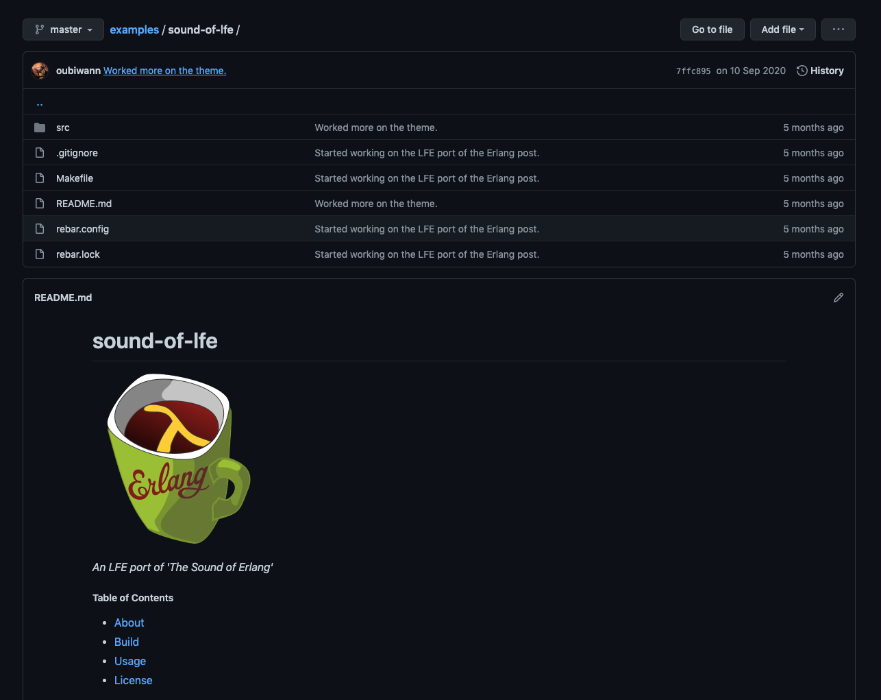
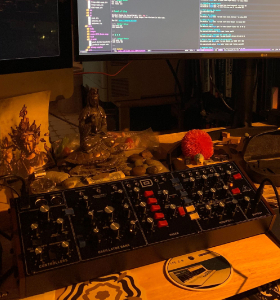
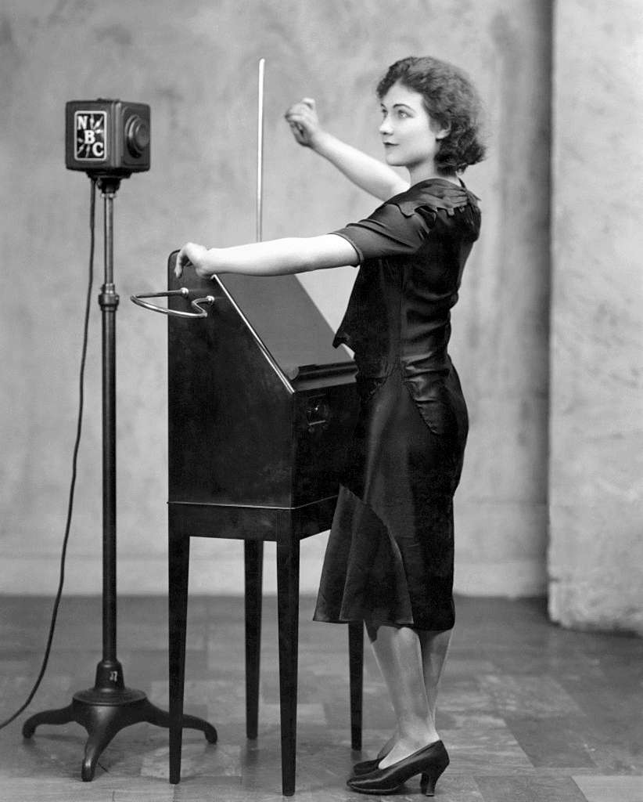
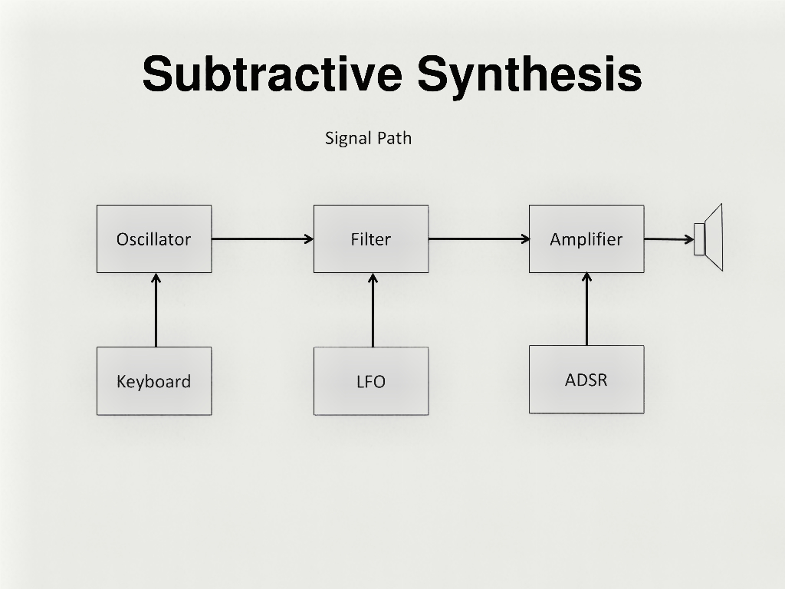
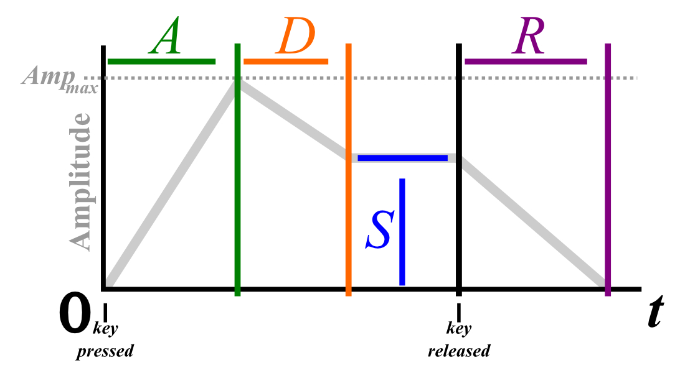
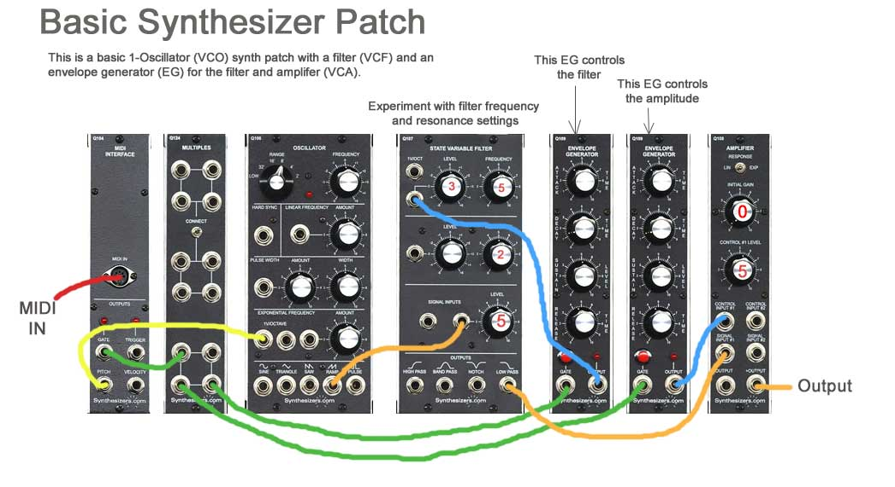
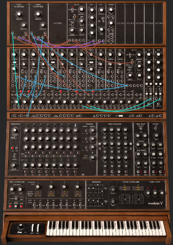
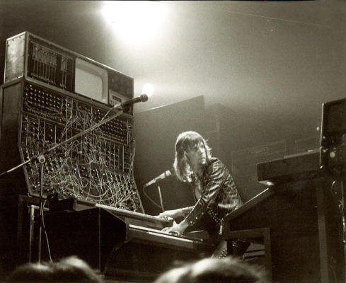

+++
title = "Sound on BEAM: Music in the Land of Distributed Lisp"
outputs = ["Reveal"]

[logo]
src = "logo-v6.svg"
+++

# Sound on BEAM: Music in the Land of Distributed Lisp

[//]: Speaker-Notes:
{}
Hello, and welcome to my talk!

My name is Duncan McGreggor, and today I'm going to share with you a little
of Lisp Flavoured Erlang, some Extempore, music synthesis and
recording, and how they all come together in the undertone project.

{}

---

## Overview

* Introduction
* undertone
* Demo
* Architecture
* Use Cases
* Languages
* FP, Global/Mutable State, and I/O
* Sound synthesis as functional programming
* Systems control for music
* What's next for undertone
* Final Q & A

[//]: Speaker-Notes:
{}
These are the topics I hope to cover.

This is a lot, but we should get through most of it!
{}

---

## Who am I?

* Prinicpal software engineer
* Life-long hacker (started at age 9 in '81; never stopped)
* Habbitual explorer
* Core contributor to Robert Virding's Lisp Flavoured Erlang (LFE)

[//]: Speaker-Notes:
{}
And here's a little bit about me ...

... but we can skip past that ;-)
{}

---

## Who am I?

* 4 yo - Messing about with Piano
* 9 or 10 yo - Formal piano lessons, casual guitar
* 14 yo - First synthesizer (analog Korg PolySix)
* 16 yo - Performed in a chamber music group
* 22 yo - Assembled a home recording studio
* 25 yo - Stopped playing music, replaced with physics / maths studies ... then career
* 48 yo - Started playing again

[//]: Speaker-Notes:
{}
... and some snippets from my brushes with music, most of which is in the relatively distant past.

In point of fact, the last musical performance I gave was as the pianist in a chamber music quartet when I was 17. 
{}

---


## Re-entering the Musical World


{}
Between then and 2014, when I was 42, I met Andrew Sorensen pictured here after his Extempore live-coding performance at OSCON.

(And yes, that dude with the short hair is me ;-))

Andrew and I talked about live coding, my interest in using LFE/OTP along with Extempore, and if I remember correctly, he mentioned conversations that he and Joe Armstrong had about Extempore and Erlang and some potential collaboration.
{}

---

## Re-entering the Musical World


{}
He then shared his performance code with me, I created a variation, blogged about it, and thus began a slow-reignition of my passion for music.

As a side note: A few years ago, I picked up the guitar again, and more recently have been relearning piano and keyboards. I'm studying music theory, and even taking some online music courses. It has been fantastic and much needed outlet.

{}

---

## Then ... Nothing

{}
Later in chatting with members of the LFE community, we talked briefly about exploring sound synthesis libraries in LFE, but none of us had the time or interest to take things much further.

Then, years later, along comes this gem of a blog post from Erlang Solutions ...

{}

---

## But!

 

{}

... by Aleksander Lisiecki

and upon seeing this, I immediately ...
{}

---

## And ...

 

{}

... did this ...!

{}

---

## And?

 

{}

... and this :-)


In essence, porting the code in that blog post to LFE.
{}

---

## Wherefore undertone?

 

{}

The path from there to undertone was mostly straight-forward: I wanted to do more than generate tones. I wanted to control synthsizers and run services ... in short, make music. I read everything I could on Erlang and music, retracing Joe Armstrong's steps from the mid-2000s up until a few short years ago. 

I implemented basic support for SuperCollider, upon which much of his work depended, but was frustrated by the lack of musicality in that particular system. At which point I returned to Extempore, and began integrating it into undertone as well.
{}

---

## What is undertone?


{}
I added enough functionality that I could generate a demo song with 9 seperate tracks of synthesizer being played. All of those were created using undertone. The end result was featured in the Lambda Days "teaser" video for this talk.

There's a lot to unpack in that work, and a brief overview of the architecture would go a long way toward giving you a good idea what undetone really is.

But before that ...
{}


---

## Demo Time


Let's have some space music!

[//]: Speaker-Notes:
{}
How about some music?
{}

---

## Demo Time


1. Creating a "space orchestra" with note transformations and multiple channels: see [the teaser video](https://www.youtube.com/watch?v=cfpAsvHW2i4&t=56s)

[//]: Speaker-Notes:
{}
The demo I had originally planned on showing you would have been a presentation of the code that was used to create the music in that teaser video.

Honestly, though, that's pretty boring: some manually defined chord definitions, some elementary transformations of lists using map and fold, etc.
{}

---

## Demo Time


2. Using `xt.midi:cc-ramp` to simulate turning the knobs on an analog synth: see [the Dallas/Fort Worth BEAMers Meetup demo](https://www.youtube.com/watch?v=DI3UcPAdayo)

[//]: Speaker-Notes:
{}
Then I decided to add support for MIDI control codes, so I could show you how LFE can control analog synthesizers like the classic minimoog, radically changing the sounds even without adjusting the notes. 

After updating undertone for this and creating a demo, I presented to the DFW Beamers ... and decided to also include it in today's talk as a bonus. Here it is:

But, I still wasn't satisfied ...

{}

---

## Demo Time


3. Towards generative music with Markov chains and chords: [HD video + sound]() (posting on Twitter now ...)

[//]: Speaker-Notes:
{}
I had promised to show conference attendees something with generative music, and these demos kept missing that mark. So I created a new piece with new code, and that's what I'm going to show you next :-)

{}

---

## Architecture


[//]: Speaker-Notes:
{}

So, here's a view of the system you just saw demoed, represented with the C4 style of architectural diagrams. Don't worry though: we'll just look at two of the four ;-)

Lest you get the wrong idea, only a small portion of this diagram is undertone. 

And I should point out that the hard work of sending MIDI messages (or playing its own sounds, as the case may be), is all done by Extempore -- Andrew Sorensen's open source live-coding software. 

{}

---

## Architecture

System context for Extempore:

* talks to the OS / routes MIDI
* signals routed to external devices
* also routed to MIDI in the DAW (e.g., software synthesizers)

[//]: Speaker-Notes:
{}
Extempore runs a TCP server to which we can connect, and then from there, gain access to the operating system's audio layer, MIDI devices, and the like.
{}

---

## Architecture

System context for undertone:

* uses Erlang (starts up supervision tree, clients, servers)
* talks to Extempore (bitstrings over TCP)
* controls OSC servers (e.g., DAWs)

[//]: Speaker-Notes:
{}
undertone spawns Extmpore as a managed OS process, starts a TCP client, and optionally starts Open Sound Control clients and servers.

All of this gets stuffed into a supervision tree that will restart these components, should you push them beyond their limits -- without crashing the Erlang VM.

{}

---

## Architecture


[//]: Speaker-Notes:
{}
Now, if we zoom in ...
{}

---



## Architecture


[//]: Speaker-Notes:
{}
... on undertone's purple box, or "container" ...
{}

 
---
 
## Architecture


[//]: Speaker-Notes:
{}
We can see a little more of what's going on under the bonnet.

The "container" view of undertone shows which components are connected to each other and how.
{}

---



## Architecture


[//]: Speaker-Notes:
{}
The grey box in the upper left is where the first demo took place. All the commands entered there were sent via the undertone-managed TCP client to the Extempore compiler server.
{}

---



## Architecture


[//]: Speaker-Notes:
{}
The grey box in the middle-right is what you saw when looking at the terminal in the second demo:

* where, after pasting all the Extempore code
* we viewed the indexed history of the entered Scheme forms
* and where all the logging output was

That REPL -- while written in LFE -- has its own commands separate from the LFE REPL.

{}

---



## Architecture


[//]: Speaker-Notes:
{}
Extempore proper, doesn't actually have a REPL of its own -- the standard way of interacting with it is by means of a text editor such as Emacs that's capable of sending Scheme forms to the Extempore TCP server for on-the-fly compilation.

In short: everything within the dashed purple border here has been written in LFE. 
{}

---



## Architecture


[//]: Speaker-Notes:
{}
Also, note that the blue "Extempore" box actually represents LFE spawning the Extempore processes and manaing the spawned port and associated state in a gen_server.
{}

---

## Architecture

The undertone "container":

* OTP app with supervisor and state server
* State server for mananging session commands and system config
* OSC clients for any OSC-enabled software running a UDP server
* TCP client for long-running connections to Extempore
* LFE REPL
* Extempore REPL

[//]: Speaker-Notes:
{}
And here's a quick textual overview of what we just covered ...
{}

---

## What Can undertone Do?

 

[//]: Speaker-Notes:
{}
In undertone, you can run functions that control a Digital Audio Workstation like the one pictured here, moving faders, endabling tracks, recording, looping -- the list goes on and on.
{}

---

## What Can undertone Do?

 

[//]: Speaker-Notes:
{}
You can not only control software devices like the Moog modular synth I showed in the demo, but you
can also control physical devices like these -- which, by the way, were genereating music written in LFE when the pictures were taken! 

On the left is a Korg Kronos, and the right shows a desktop analog synth, a minimoog clone by Behringer.
{}

---

## What Can undertone Do?

* Long, slow looping music in given keys, but random notes or intervals
* Accompanyment for practice
* Jam sessions
* Endless, non-repeating background, ambient music

[//]: Speaker-Notes:
{}
Practically speaking, though, this is how _I'll_ be using undertone!
{}

---

## So Far

*  Introduction
*  undertone
*  Demo
*  Architecture
*  Use Cases
* Languages
* FP, Global/Mutable State, and I/O
* Sound Synthesis as Functional Programming
* What's Next for undertone
* Q & A


[//]: Speaker-Notes:
{}
Okay, here's a quick refresher on what we've covered and what's left to do ... 
{}

---



## Erlang & LFE

An example: a recursive function using pattern-matching in the function heads.

#### Erlang

```erlang
ackermann(0, N) ->
  N+1;
ackermann(M, 0) ->
  ackermann(M-1, 1);
ackermann(M, N) when M > 0 andalso N > 0 ->
  ackermann(M-1, ackermann(M, N-1)).
```

#### LFE

```clj
(defun ackermann
  ((0 n) (+ n 1))
  ((m 0) (ackermann (- m 1) 1))
  ((m n) (ackermann (- m 1) (ackermann m (- n 1)))))
```

[//]: Speaker-Notes:
{}
It's probably a goot bet that most attendees at the conference are more familiar with Erlang than LFE, so here's a little comparison to help you get your bearings.

This is the same funciton -- written in each -- demonstrating some basic recursion as well as pattern matching in the function heads.
{}

---

## Extempore

xtlang:

``` scheme
(bind-func AudioBuffer_data_b64
  (lambda (ab:AudioBuffer*)
    (let ((b64size:i64 0)
          (datsize:i64 (* (AudioBuffer_frames ab)
                          (AudioBuffer_channels ab) 4)))
      (String (base64_encode (cast (tref ab 4) i8*)
                             datsize
                             (ref b64size))))))
```

[//]: Speaker-Notes:
{}
If that wasn't complicated enough, there are two more languages invloved here as well. This is Extempore's xtlang, which provides low-level access to all aspects of the Extempore system.

{}

---

## Extempore

Scheme:

``` scheme
(sys:load "libs/external/portmidi.xtm")
(pm_initialize)
(define *midi-out* (pm_create_output_stream 3))

(define midi-loop
  (lambda (beat dur)
    (mplay *midi-out*
           (random (list 36 43 48 51 60 60 60 67 70 74 75))
           (random 60 80)
           dur 0)
    (callback (*metro* (+ beat (* .5 dur)))
              'midi-loop
              (+ beat dur)
              dur)))

(midi-loop (*metro* 'get-beat 4) 1/4)

(define midi-loop
  (lambda (beat dur) #t))
```

[//]: Speaker-Notes:
{}
And this is Extempore's higher-level language, a derivative of Tiny Scheme.

This is what most Extempore performers use -- and, in fact, is what you saw me pasting into the REPL at the beginning of the demo.
{}

---

## FP in an I/O World

A mutable, global system bent upon I/O

``` scheme
(sys:load "libs/external/portmidi.xtm")
(pm_initialize)
(define *midi-out* (pm_create_output_stream 3))

(define midi-loop
  (lambda (beat dur)
    (mplay *midi-out*
           (random (list 36 43 48 51 60 60 60 67 70 74 75))
           (random 60 80)
           dur 0)
    (callback (*metro* (+ beat (* .5 dur)))
              'midi-loop
              (+ beat dur)
              dur)))

(midi-loop (*metro* 'get-beat 4) 1/4)

(define midi-loop
  (lambda (beat dur) #t))
```

[//]: Speaker-Notes:
{}
In both cases developers are accessing mutable data, changing elements of the system as it runs, and using those changes to generate music. While perfectly suited for what it does, the appeal to a functional programmer is perhaps not immediately apparent.
{}

---



## FP in an I/O World

An LFE sequencer in undertone?


[//]: Speaker-Notes:
{}
But a second or third glance might inspire such a programmer to look at a classic sequencer such as this one -- which, by the way, were based upon telephon switching hardware -- and  ...
{}

---



## FP in an I/O World

Yes!

``` lisp
(set opts (xt.seq:midi-opts sequence-name
                            device-name
                            device-id
                            midi-channel
                            seq1
                            pulse1
                            beats-per-minute
                            beats-per-measure
                            note-timing))
(xt.seq:start opts)
(xt.midi:cc-ramp (mupd opts 'cc-code (cutoff-filter-1)) 15 40 5)
(xt.seq:set-midi-notes! (mupd opts 'notes '(c3 c3 c4  c4 a#3 g3)))
```

[//]: Speaker-Notes:
{}
... use immutable data structures and all the language's vast resources to carefully manage that global state with code like this:

In the first demo you sawe me calling functions such as these to start, modify, and stop a sequencer in LFE.
{}

---

## FP in an I/O World


[//]: Speaker-Notes:
{}
This approach to managing Extempore's state -- as you may well imagine -- helps a programmer to keep much better track of what's going on and how to change the system in a predictable manner.

{}

---


## Synthesis as Functional Programming


[//]: Speaker-Notes:
{}
Next we'll touch on the topic of sound synthesis, and in particular, its fundamental concepts and how well these map to the principals of functional programming.

This topic deserves a little context, though ... so let's take a scenic route
{}

---

## The Beginnings of Sound Synthesis


[//]: Speaker-Notes:
{}
This is a picture of the Telharmonium or Dynamophone, and early electro-mechanical musical device created in 1896. Only the smallest portion is shown: essentially the console. The bulk of the instrument remained housed in the basement of the performance hall, connected to the console via electrical wires. And I do mean bulk: the second and third iterations of this instrument weighed 210 tonnes.
{}

---

## The Beginnings of Sound Synthesis



[//]: Speaker-Notes:
{}
On the other end of the spectrum was this device, the Theremin: created in the 1920s. It was this device that originally captured the imagination and electrical engineering skills of Bob Moog, eventual invetor of the Moog synthesizer. His company still manufactures Theremins today.
{}

---

## The Beginnings of Sound Synthesis


[//]: Speaker-Notes:
{}
And then there was Peter Zinovieff who had this kit in his garden shed in Britain. He was the son of a Russian princess and the first private owner of PDP-8s as personal computers (he had two of them -- both used for sound synthesis). Zinovieff worked with Pink Floyd

He and Bob Moog had a lot of the same ideas created independently of each other, both using voltage-controlled filters to produce sounds.
{}

---

## The Beginnings of Sound Synthesis



[//]: Speaker-Notes:
{}
By the mid-60s sound synthesis had converged upon the basics of what is now called "Subtractive Synthesis": an oscillating sound source acts as input for various filters, amplifiers, modulators, etc.
{}


---

## Synthesis as Functional Programming



[//]: Speaker-Notes:
{}
Here is a graphic depiction of what has become one of the foundations of sound synthesis, originally used to electronnically model the behaviour of physical musical instruments. This is a depiction of "envelope" or how a sound changes over time. It was originally implemented with a doorbell switch initating the envelope trigger event and a capacitor to gradually release the voltage associated with the musical note.

In essence, then, what we have here is a function generating output -- the keypress; and then that output being transformed in a specific, repeatable manner given the state of the envelope at any given point in time.
{}

---

## Synthesis as Functional Programming



[//]: Speaker-Notes:
{}
To provide some context, the ADSR parameters of the envelope generator are shown here in the third and second to last modules on the right, each affecting different parts of the signal chain.
{}

---



## Synthesis as Functional Programming


[//]: Speaker-Notes:
{}
This is a diagram from an introduction to modular synthesis on the web site synthesizer.com.

It represents a very simple setup or "patch" where MIDI signals are providing the messages that generate the initial volatge.

Subsequent modules in the signal chain modify that signal or are used to affect another module that will ultimately modify the total output of the system.
{}

---



## Synthesis as Functional Programming


[//]: Speaker-Notes:
{}
One intersting differnce between analog computing such as this and the functional programming we are more used to is the temporal element. We generally don't run into something analogous to this at the language level; rather we see this in I/O systems that change over time, such as messaging or stream processing frameworks.

Of course, from the mathematical perspective, this puts us solidly in the realm of the calculus and partial differential equations.
{}

---

## Synthesis as Functional Programming


[//]: Speaker-Notes:
{}
For the electronically minded, here's a logical digram of the previous patch cable diagram. This should help make the point more clearly: that sound synthesis of this form is reducable to the standard mathematical approximations of electronic circuit operations, arguably deeply functional in nature, if thoroughly within the domain of I/O.
{}

---

## Synthesis as Functional Programming



[//]: Speaker-Notes:
{}
Extending the patch example I've just shown to something in practice: here is a screenshot of the same Moog modular synth I used in the demo.

Note that this is a _very simple_ patch! However, despite the increasing complexity, the same principles apply ... with the various modules producing outputs that become the inputs of other modules.

As you might be intuiting with the cable-crossing seen here,
the degree to which one may apply the outputs of one module may lead to an exponential increase in complexity.
{}

---

## Synthesis as Functional Programming



[//]: Speaker-Notes:
{}
And could result in taking the thing to its logical extreme ...

which gives us the likes of Keith Emerson from Emerson, Lake, and Palmer.

His synth patches are famous for their great sounds and stunning electronic complexity. And he had a _monster_ of a custom Moog setup -- which was equally famous.

Oh, what a lucky man he was ...
{}

---


## What's Next for undertone?

 

[//]: Speaker-Notes:
{}
So what's next for undertone? I have created tickets for efforts such as:

* Deeper support of Extempore in native LFE
* Live capture of music, recorded as LFE data structures
* A Hybrid LFE/Extempore REPL
* Digital Signal Processing from LFE
* More support for open source synthesizers
* Explore the collaboration possibilities with the distributed platform that LFE offers
* Lots of practical use in generating music, exploring music theory ... and just _listening!_
{}

---

## Land of Lisp

Special thanks to Conrad Barski, M.D. <br />
for his kind permission in using images from his book in this talk.

Buy it! http://landoflisp.com/

[//]: Speaker-Notes:
{}
{}

---

## Closing Q & A

[//]: Speaker-Notes:
{}
{}

---

#### Contact

*  oubiwann@gmail.com
*  [@oubiwann]()
*  [linkedin.com/in/oubiwann]()
*  [@forgottentones]()
*  https://soundcloud.com/forgotten-tones/tracks

[//]: Speaker-Notes:
{}
Here's how you can reach me ...
{}

---

#### LFE Resources

*  https://lfe.io/
*  https://github.com/rvirding/lfe
*  [lfe.slack.com]()
*  http://groups.google.com/group/lisp-flavoured-erlang
*  [@ErlangLisp]()

[//]: Speaker-Notes:
{}
Here's where stuff is ...
{}

---

#### undertone Resources

*  https://github.com/ut-proj/undertone
*  https://undertone.lfe.io/book
*  [lfe.slack.com]() #algo-sound
*  http://groups.google.com/group/lfe-undertone
*  [@lfeundertone]()
*  https://www.instagram.com/lfeundertone/

---

{}

## Overview

* Background, sound in the digital world, etc.
* Homage: Joe Armstrong's explorations
* Extempore vs. SuperCollider
* Lisp Flavoured Erlang 2.0
* Extempore in OTP
* Making Music

[//]: Speaker-Notes:


## Background (me)

* 4 yo - Messing about with Piano
* 8 yo - Started formal piano lessons, casual guitar
* 16 yo - Performed in a chamber music group
* 22 yo - Assembled a home recording studio
* 25 yo - Stopped playing music, replaced with physics / maths studies
* 48 yo - Started playing again

[//]: Speaker-Notes:


## Terminology

#### Algorithmic Composition

=?=

#### Generative Music

[//]: Speaker-Notes:


## Background (generative music)

<ul>
<li class="fragment">1957 - Max Mathews MUSIC-1 on the IBM 704</li>
<li class="fragment">(1958 - LISP, also on the IBM 704)</li>
<li class="fragment">1962 - Sekine & Hayashi on the TOSBAC</li>
<li class="fragment">1964 - Moog & Deutsch with prototype synthesizers; Don Buchla creates the first commercial analog sequencer on the Buchla 100</li>
<li class="fragment">1969 - Max Mathews GROOVE on a Honeywell DDP-24; Peter Zinovieff MUSYS on PDP-8s</li>
<li class="fragment">1971 - EMS releases first digital sequencer</li>
</ul>

[//]: Speaker-Notes:


## Background (generative music)

<ul>
<li class="fragment">1957 - Max Mathews MUSIC-1 on the IBM 704</li>
<li class="fragment">(1958 - LISP, also on the IBM 704)</li>
<li class="fragment">1962 - Sekine & Hayashi on the TOSBAC</li>
<li class="fragment">1964 - Moog & Deutsch with prototype synthesizers; Don Buchla creates the first commercial analog sequencer on the Buchla 100</li>
<li class="fragment">1969 - Max Mathews GROOVE on a Honeywell DDP-24; Peter Zinovieff MUSYS on PDP-8s</li>
<li class="fragment">1971 - EMS releases first digital sequencer</li>
</ul>

[//]: Speaker-Notes:


## Background (digital music)

<ul>
<li class="fragment">Early 1980s - Musical Interface Digital Interface (MIDI) standard created</li>
<li class="fragment">1990s - Digital music recording took off</li>
<li class="fragment">2000s - Recording on regular PCs</li>
<li class="fragment">Early 2010s - Open Sound Control (OSC) standard created </li>
<li class="fragment">2010s - Digital Audio Workstation (DAW) software, tube/analog emulation, live-coding</li>
</ul>

[//]: Speaker-Notes:


## Erlang & Sound

<ul>
<li class="fragment">XXX</li>
<li class="fragment">XXX</li>
<li class="fragment">XXX</li>
<li class="fragment">XXX</li>
<li class="fragment">XXX</li>
</ul>

[//]: Speaker-Notes:


## Extempore vs. SuperCollider

<ul>
<li class="fragment">XXX</li>
<li class="fragment">XXX</li>
<li class="fragment">XXX</li>
<li class="fragment">XXX</li>
<li class="fragment">XXX</li>
</ul>

[//]: Speaker-Notes:


## undertone

What is it good for?

[//]: Speaker-Notes:


## Review

*  Background, sound in the digital world, etc.
*  Homage: Joe Armstrong's explorations
*  Extempore vs. SuperCollider
* Lisp Flavoured Erlang 2.0
* Extempore in OTP
* Making Music

[//]: Speaker-Notes:




## LFE

What is it?

```erlang
ackermann(0, N) ->
  N+1;
ackermann(M, 0) ->
  ackermann(M-1, 1);
ackermann(M, N) when M > 0 andalso N > 0 ->
  ackermann(M-1, ackermann(M, N-1)).
```

```clj
(defun ackermann
  ((0 n) (+ n 1))
  ((m 0) (ackermann (- m 1) 1))
  ((m n) (ackermann (- m 1) (ackermann m (- n 1)))))
```

[//]: Speaker-Notes:


## Don't Panic

[//]: Speaker-Notes:


## Q & A Time

[//]: Speaker-Notes:

{}
