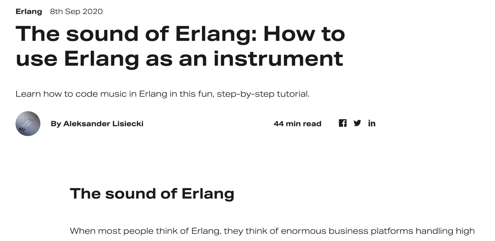
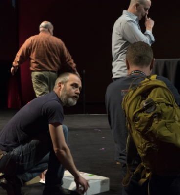
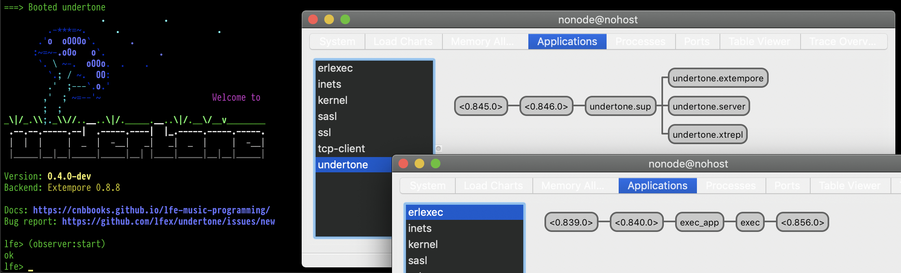
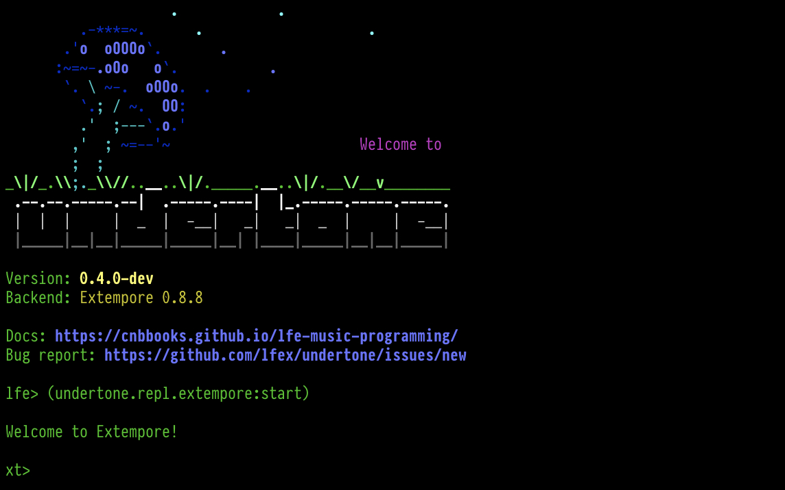

+++
title = "Sound on BEAM: Music in the Land of Distributed Lisp"
outputs = ["Reveal"]

[logo]
src = "logo-v6.svg"
+++

# Erlang Music Systems Programming with Lisp

[//]: Speaker-Notes:
{}

So, I've given several talks this year on undertone and music programming with
Extempore and Lisp Flavoured Erlang -- this aims to be casual combination of the
best of those :-)

{}

---

## Overview

* Introduction
* undertone and Its Use Cases
* Architecture
* Supervision Trees
* Clients and Servers
* External Processes, Ports, and `exec`
* Languages
* A Custom REPL
* Demo / Performance / Walkthrough
* What's Next for undertone
* Open Discussion

[//]: Speaker-Notes:
{}

The general plan is to cover these topics, but this is less a presentation
and more a dialogue -- so we may end up veering off at odd angles ...

{}

---

## Who am I?

* Prinicpal software engineer
* Life-long hacker (started at age 9 in '81; never stopped)
* Habbitual explorer
* Core contributor to Robert Virding's Lisp Flavoured Erlang (LFE)

[//]: Speaker-Notes:
{}

Here are some superficial bullet points about me ...

Btw, my first computer was a CP/M Kaypro II running on a Zilog-80 chip,
with the entire OS on a 5 1/4 floppy -- no hard drive.

{}

---

## Who am I?

* 4 yo - Messing about with Piano
* 9 or 10 yo - Formal piano lessons, casual guitar
* 14 yo - First synthesizer (analog Korg PolySix)
* 16 yo - Performed in a chamber music group
* 25 yo - Stopped music; replaced with physics/maths ... then career
* 42 yo - Began exploring generative music
* 48 yo - Started playing seriously again

[//]: Speaker-Notes:
{}

Here's some musical background info ...

But there's a new bullet for this list now:

Just this semester I started taking classes at Berklee School of Music, online, gearing up
for a series of courses in arranging and orchestral composition.

How this ties into generative music, though? At OSCON 2014 ...

{}

---


## Re-entering the Musical World


{}

... I met Andrew Sorensen -- pictured here -- after his Extempore live-coding performance keynote.

(And yeah, that's me -- the one nearest him).

Andrew and I talked about live coding including my interest in using LFE/OTP along with Extempore.

{}

---

## Re-entering the Musical World


{}

I believe he also mentioned previous conversations between himself and Joe Armstrong about Extempore and Erlang -- including some possibilities for collaboration.

I started using Extempore immediately after Andrew's performnace, when he shared his keynote code with me. Life pulled me in other directions, and I didn't do much with it

Last year, however, I picked it up again ...

{}

---

## Re-entering the Musical World



{}

... after I saw this blog post which covered sound generation in Erlang.

I ported the code to LFE, and sufficiently re-inspired, proceeded to create the undertone project.

---

## Wherefore undertone?


{}

But _why_ undertone? In a world with SuperCollider, Overtone, SonicPi, etc., what need is there?

I didn't want to build a new music system, rather just needed something that could accomodate my music needs.

{}

---


## Wherefore undertone?

* I'm a Lisper and want to write Lisp in my spare time
* I need something that has fault-tolerance baked-in
* Needs to be network-programming-friendly, too

{}

However, these needs were quickly growing, and I was asking a great deal of the systems with which I was working -- and I eventually asked too much, and various components started failing, requiring hand-holding, and more time. I needed something that could do this automatically.

{}

---

## Wherefore undertone?

So LFE as the core language seemed a no-brainer to me.

{}

As such, I started by reading everything I could on Erlang and music, retracing Joe Armstrong's steps from the mid-2000s up until a few short years ago.

{}

---

## Wherefore undertone?


{}

As such, one of the first features that landed in undertone was support for Open Sound Control (or OSC). This allowed me to run several of Joe's code samples from within a structured project using a custom backend for SuperCollider.

Ultimately, though, I became frustrated by my admittedly subjective perception that SuperCollider seems to lack an element of musicality -- a feeling that echoed my previous experiences with it.

{}

---

## Wherefore undertone?



{}

Remembering my wonderful experience with Extempore, I turned there next.

Within a few days I'd added a new backend in undertone, one that allowed me to run Extempore code from LFE.

{}

---

## Wherefore undertone?


{}

In my practice sessions with guitar and synthesizers, I wanted to be able to quickly write just a few lines of code for some ambient backing sounds ...

{}

---

## Wherefore undertone?


{}

... or chord progressions against which I could practice scales, or experiment with intervals and counterpoint.

Additionally, I've started using undertone for practice sessions where I write code that plays chords progressions randomly, but for which I get visual feedback on the current chord, beats remaining, text chord, etc.

CLICK TO OTHER TAB

{}

---

## Summary of the "why"s

* Create music in my preferred language
* Monitoring and automatically restarting OS processes
* Speak to Open Sound Control servers (i.e., controlling faders on software consoles/mixers)

{}

All of that can be distilled into this and the next few slides ...

{}

---

## Summary of the "why"s


* Potentially host my own OSC servers
* Send TCP packages to the Extempore compiler service
* Automtically reconnect (with backoff support) to required services
* Be able to restart any of these components in the event of partial or complete system failure

{}


{}

---

## Summary of the "why"s


* Maintain multiple, separate state contexts
* Support a familiar workflow (a REPL!)
* Provide basic session management (ETS + a handful of functions)
* Have easy, visual instrumentation on the music as it is being generated

{}

This is how undertone came about ... next, we can take a look at how it has been built.

{}

---



## What is undertone?


{}

undertone is an idea and a set of needs which depend upon multiple systems in order to realise the goal of making music reliably.

This is the sort of diagram that has been shown at Erlang conferences for years ... 

{}

---

## Architecture


[//]: Speaker-Notes:
{}

But here is a diagram that is perhaps a bit more useful: a view of the system configured to use the Extempore backend, with all of the high-level communications involved.

PAUSE TO WALK THROUGH PROCESS OF MAKING MUSIC

{}

---

## Architecture

System context for Extempore:

* talks to the OS / routes MIDI
* signals routed to external devices
* also routed to MIDI in the DAW (e.g., software synthesizers)

[//]: Speaker-Notes:
{}
Extempore runs a TCP server to which we can connect, and then from there, gain access to the operating system's audio layer, MIDI devices, and the like.
{}

---

## Architecture

System context for undertone:

* uses Erlang (starts up supervision tree, clients, servers)
* talks to Extempore (bitstrings over TCP)
* controls OSC servers (e.g., DAWs)

[//]: Speaker-Notes:
{}
undertone spawns the `extmpore` binary as a managed OS process, starts a TCP client, and optionally starts Open Sound Control clients and servers.

All of these go into a supervision tree that will restart these components, should one or more of them be pushed beyond their limits -- all without crashing the Erlang VM.

{}

---

## Architecture


[//]: Speaker-Notes:
{}

In addition to Extempore support ...

{}

---

## Architecture


[//]: Speaker-Notes:
{}

I'm working on a new backend using two CLI tools created by the head of software engineering at Moog: Geert Bevin. These are Erlang ports opened to long running OS processes.

{}

---

## Architecture


[//]: Speaker-Notes:
{}

Back to the Extempore backend:

If we zoom in on the section ...

{}

---



## Architecture


[//]: Speaker-Notes:
{}

... within the dashed purple border ...

{}


---

## Architecture


[//]: Speaker-Notes:
{}
We can see a little more of how undertone pulls systems together.

This particular view of the architecture shows which undertone LFE and OTP components are connected to each other and how.

PAUSE TO TALK ABOUT HOW THE SYSTEM STARTS UP

{}

---

## Architecture


[//]: Speaker-Notes:
{}

SWITCH TO EMACS 

SHOW LFE / OTP CODE

{}

---



## Architecture


[//]: Speaker-Notes:
{}

Note that everything within the purple dashed boundary except the Extepore component, has been written in LFE.

{}

---

## Architecture

The undertone "container":

* OTP app with supervisor and state server
* State server for mananging session commands and system config
* OSC clients for any OSC-enabled software running a UDP server
* TCP client for long-running connections to Extempore
* LFE REPL
* Extempore REPL

[//]: Speaker-Notes:
{}

Here's a quick textual summary of all those diagrams ...

{}

---

## Progress Check

* ✅ Introduction
* ✅ undertone and Its Use Cases
* ✅ Architecture
* Supervision Trees
* Clients and Servers
* External Processes, Ports, and exec
* A Custom REPL
* Demo / Performance / Walkthrough
* What's Next for undertone
* Open Discussion

{}

And here's a reminder on what we've covered so far ...

{}


---

## Supervision Trees


[//]: Speaker-Notes:
{}

Now let's take a closer look at undertone's supervision tree.

This is of special importance for undertone, since it is the core of what undertone uniquely offers to the world of programmatic and generative music.

{}

---

## Supervision Trees


[//]: Speaker-Notes:
{}

Here's the current undertone supervisor `init` function.

Based upon OTP release configuration`sys.config` values, the appropriate child processes will be created, some specific to a backend.

This is, of course, easily extendable to any backend or other related service which might be needed in the future.

{}

---

## Supervision Trees



[//]: Speaker-Notes:
{}

When undertone is run with the Extempore backend, it supervises:

1. the general undertone server common to all backends
2. a server specific to the Extempore backend
3. and then an additional server that manages the Extempore REPL sessions

The backend-specific server then opens an Erlang port to manage the OS process in which the Extempore binary is running.

{}

---

## Supervision Trees


[//]: Speaker-Notes:
{}

Things are a little different for the "Bevin" backend:

* while there's still the general server
* and a backend-specific server

There's no custom REPL. This backend doesn't have its own language, unlike Extempore, so we don't need one: we get to use the regular LFE REPL.

Also, there are _two_ OS processes for the separate binaries which comprise this backend: A MIDI tool for sending MIDI messages, and another for receiving them.

{}

---

## Clients and Servers

* Extempore client
  * TCP client for sending messages to the compiler server
  * Scheme syntax as bitstrings
  * Started by the release

[//]: Speaker-Notes:
{}

The clients and servers used as part of undertone are standard fare, so I'll just gloss over them

{}

---

## Clients and Servers

* Open Sound Control clients
  * potentially many
  * connecting to both software and hardware
  * e.g., digital audio workstations (DAWs) to control console faders

[//]: Speaker-Notes:
{}

But if anyone has questions about these we can pause here ...

{}

---

## Clients and Servers

* Open Sound Control servers
  * none right now
  * could create an OSC/MIDI bridge in LFE/Erlang
  * create a custom Raspberry Pi sound device and export OSC methods
* erlsci/osc is UDP only

[//]: Speaker-Notes:
{}

... or come back to them ...

{}

---

## Clients and Servers

* `gen_servers` for state management
* The Extempore REPL is a simple looping server
* The undertone backends each have their own `gen_server` that's responsible for managing the backend

[//]: Speaker-Notes:
{}

The `gen_server` is a generic server pattern in OTP, but there are other more special purposes ones such as `gen_event`, `gen_statem`, etc.

{}

---

## External Processes & Erlang Ports

* Previously used `erlang:open_port` (`spawn_executable`)
* Switched to `exec` library (which still uses Erlang ports)
* Extempore backend:
  * capturing output from Extempore
* "Bevin" backend:
  * sending MIDI (OS process)
  * receiving MIDI (separate OS process)
  * stdout is captured for both and logged / parsed

[//]: Speaker-Notes:
{}

Erlang's solution to language interop is really quite elegant: no FFIs, but rather -- being a message-passing language -- it defines a simple binary protocol, and data in this protocal can be sent to the `stdin` of a running process.

I've used this approach to manage other applications from LFE, all stuffed into an OTP supervision tree. This includes apps written in Common Lisp, Go, Python, and even Rust.

{}

---

## External Processes & Erlang Ports

* Previously used `erlang:open_port` (`spawn_executable`)
* Switched to `exec` library (which still uses Erlang ports)
* Extempore backend:
  * capturing output from Extempore
* "Bevin" backend:
  * sending MIDI (OS process)
  * receiving MIDI (separate OS process)
  * stdout is captured for both and logged / parsed

[//]: Speaker-Notes:
{}

Spawning external processes can be a little tricky, though -- especially if they will be long-lived.

The low-level Erlang library functions for spawning and linking to an external process are just that 
and don't include external process management and tracking capabilities.

{}

---

## External Processes & Erlang Ports

* Previously used `erlang:open_port` (`spawn_executable`)
* Switched to `exec` library (which still uses Erlang ports)
* Extempore backend:
  * capturing output from Extempore
* "Bevin" backend:
  * sending MIDI (OS process)
  * receiving MIDI (separate OS process)
  * stdout is captured for both and logged / parsed

[//]: Speaker-Notes:
{}

Fortunately, the erlexec project does support this, and with an API that
is just as simple to use as Erlang ports. And erlexec itself uses ports.

{}

---

## Dependencies

* https://github.com/saleyn/erlexec
  * Addresses issues with terminating OS processes
  * Keeps to the spirit of Erlang's clean Port API
  * Used to manage 2 of 3 backends in undertone

[//]: Speaker-Notes:
{}

I have several slides on the dependencies, each kind of interesting in its own right, but we can skip over these unless there are specific questions about them.

{}

---

## Dependencies

* https://github.com/erlsci/osc
  * Forked from https://github.com/marianoguerra/erlang-osc
  * 5-10 year old code, updated per rebar3 project best practices

[//]: Speaker-Notes:
{}

...

{}

---

## Dependencies

* https://github.com/lfex/tcp-client
  * Originally used https://github.com/cabol/tcp_client
  * Abandoned that effort in favour of an implementation based upon `gen_statem` using https://andrealeopardi.com/posts/connection-managers-with-gen_statem/
  * Written in LFE

[//]: Speaker-Notes:
{}

...

{}

---

## Dependencies

* https://github.com/ferd/backoff
  * A readily available and easy to use exponential backoff library

[//]: Speaker-Notes:
{}

...

{}

---

## Progress Check

* ✅ Introduction
* ✅ undertone and Its Use Cases
* ✅ Architecture
* ✅ Supervision Trees
* ✅ Clients and Servers
* ✅ External Processes, Ports, and exec
* Languages
* A Custom REPL
* Demo / Performance / Walkthrough
* What's Next for undertone
* Open Discussion

{}

Aaaaand another update on the ground we've covered so far ...

{}

---



## Erlang & LFE


Basics: a recursive function using pattern-matching in the function heads.

#### Erlang

```erlang
ackermann(0, N) ->
  N+1;
ackermann(M, 0) ->
  ackermann(M-1, 1);
ackermann(M, N) ->
  ackermann(M-1, ackermann(M, N-1)).
```

#### LFE

```clj
(defun ackermann
  ((0 n) (+ n 1))
  ((m 0) (ackermann (- m 1) 1))
  ((m n) (ackermann (- m 1) (ackermann m (- n 1)))))
```

[//]: Speaker-Notes:
{}

Let's take a look at some code, next :-)

This is some syntax in Erlang and LFE for function-head pattern-matching and recursion,
and should give you a sense of how LFE evolved as a Lisp, with its parent essentially being
a distributed Prolog ;-)

{}

---

## Erlang & LFE

OTP: Erlang `supervisor`

```erlang
-module('undertone.sup').
-behaviour(supervisor).
-export([start_link/0]).
-export([init/1]).

start_link() ->
    supervisor:start_link({local, ?MODULE}, ?MODULE, []).

init([]) ->
    {ok, {sup_flags(),
          [child('undertone.server', start_link, [])]}}.

sup_flags() ->
    #{strategy => one_for_one,
      intensity => 3,
      period => 60}.
```

[//]: Speaker-Notes:
{}

For a comparison of slightly more involved code, here is a partial implementation of the iconic OTP supervisor in Erlang.

{}

---



## Erlang & LFE

OTP: LFE `supervisor`

```clj
(defmodule undertone.sup
  (behaviour supervisor)
  (export
   (start_link 0)
   (init 1)))

(defun start_link ()
  (supervisor:start_link `#(local ,(MODULE)) (MODULE) '()))

(defun init (_args)
  `#(ok #(,(sup-flags)
          (,(child 'undertone.server 'start_link '())))))

(defun sup-flags ()
  `#m(strategy one_for_one
      intensity 3
```

[//]: Speaker-Notes:
{}

And the same in LFE.

Back to undertone:

When using the Extempore backend, there are another two languages to consider, both derivations of Scheme ...

{}

---

## Extempore

xtlang:

``` scheme
(bind-func AudioBuffer_data_b64
  (lambda (ab:AudioBuffer*)
    (let ((b64size:i64 0)
          (datsize:i64 (* (AudioBuffer_frames ab)
                          (AudioBuffer_channels ab) 4)))
      (String (base64_encode (cast (tref ab 4) i8*)
                             datsize
                             (ref b64size))))))
```

[//]: Speaker-Notes:
{}

This is Extempore's xtlang, which provides low-level access to all aspects of the Extempore system, essentially a thin Scheme layer over Extempore's low-level C code.

{}

---

## Extempore

Scheme:

``` scheme
(sys:load "libs/external/portmidi.xtm")
(pm_initialize)
(define *midi-out* (pm_create_output_stream 3))

(define midi-loop
  (lambda (beat dur)
    (mplay *midi-out*
           (random (list 36 43 48 51 60 60 60 67 70 74 75))
           (random 60 80)
           dur 0)
    (callback (*metro* (+ beat (* .5 dur)))
              'midi-loop
              (+ beat dur)
              dur)))

(midi-loop (*metro* 'get-beat 4) 1/4)
```

[//]: Speaker-Notes:
{}
And this is Extempore's higher-level language, a derivative of TinyScheme.

This is what most Extempore performers use -- and is what you'll see me using in the custom REPL during the demo.
{}

---

## A Custom REPL



[//]: Speaker-Notes:
{}

Extempore, of course, can stand on its own magnificently -- I frequently switch between using it
in undertone and using it in Emacs.

One of the benefits of using it with undertone, though, is the
REPL for Extepore which undertone provides.

{}

---

## A Custom REPL


[//]: Speaker-Notes:
{}

Extempore proper, doesn't actually have a REPL of its own -- the standard way of interacting with it is by means of a text editor such as Emacs or VS Code which are  capable of sending Scheme forms to the Extempore TCP server for on-the-fly compilation.

Calling the `start` function, as pictured here, is how one enters this
REPL.

{}

---

## A Custom REPL


[//]: Speaker-Notes:
{}

One may type the `(help)` function to display the
list of possible commands.

{}

---

## A Custom REPL


[//]: Speaker-Notes:
{}

And the `(sess)` command displays an indexed
list of all Extempore forms and REPL commands entered during
the given session.

Additional commands are available for re-running one or more of the previous
entries in this list.

{}

---



## A Custom REPL


[//]: Speaker-Notes:
{}

A final note on this topic: The Extempore REPL was implemented in LFE using the classic approach invented
by members of the Lisp community in the early 1960s:

read-eval-print and loop :-)

{}

---

## Demos


[//]: Speaker-Notes:
{}

Okay, demo time.

Word of warning, though -- general teleconferencing has not reached the levels of hi-fi that we would all love to have. And routing sound on a computer for such software is cumbersome at best!

There's a chance you will hear cracking and popping in the audio that I don't hear at my end, which is too bad -- since I've chosen absolutely gorgeous audio samples and plugins that are a delight for the ears.

{}

---

## Demos

* Eric Whitacre Choir sample: https://soundcloud.com/oubiwann/chopin-op-28-no-20-c-minor-choir
* Ravenscroft 9' grand: https://soundcloud.com/oubiwann/journey-of-the-source-variation-3

(the latter was created with LFE/undertone)

[//]: Speaker-Notes:
{}

If you'd like to hear two examples of those without teleconferencing sodftware getting in the way, you can give these a listen.

{}

---

## Demo 1

(pre-recorded)

https://youtu.be/-mTUNt3N5AU

[//]: Speaker-Notes:
{}

Okay, with that aside, we'll start with a pre-recorded demo ...

SWITCH TAB

{}

---

## Demo 2

Interactive session in Emacs ...

Source talk: https://youtu.be/xpSYWd_aIiI

[//]: Speaker-Notes:
{}

This next demo is based upon a talk that Andrew Sorensen gave at CodeMania 2015 where he gives a tongue-in-cheek rendition of Wester musical history cast against the various series of Black Adder.

{}

---

## What's Next for undertone?


[//]: Speaker-Notes:
{}
So what's next for undertone?

I have created project tickets for efforts such as:

* Finishing the new MIDI-only, "Bevin" backend
* Deeper support of Extempore in native LFE
* Live capture of music, recorded as LFE data structures
* Digital Signal Processing from LFE
* More support for open source synthesizers
* Exploring the collaboration possibilities with the distributed platform that LFE offers
* Lots of practical use in generating music, music theory, etc. ...
* And just making long-form pieces for the pure enjoyment of _listening!_
{}

---

## Progress Check

* ✅ Introduction
* ✅ undertone and Its Use Cases
* ✅ Architecture
* ✅ Supervision Trees
* ✅ Clients and Servers
* ✅ External Processes, Ports, and exec
* ✅ Languages
* ✅ A Custom REPL
* ✅ Demo / Performance / Walkthrough
* ✅ What's Next for undertone
* Open Discussion

{}

And, for the sake of completeness, here are the checked-off topics.

{}

---

## Credits

[Ent drawing](https://talbotjenkins.wixsite.com/talbotjenkins/miscellaneous?lightbox=dataItem-jpkmxxse) by Talbot Jenkins.

<br />

Beginnig of first piece in demo adapted for Piano, based upon "Journey of the Sorcerer" by Bernie Leadon of The Eagles.


[//]: Speaker-Notes:
{}

Special thanks to the Ent artist and for the original creator and performers of the Hitchhiker's Guide to the Galaxy theme.

{}

---

#### Contact

* oubiwann@gmail.com
* [@oubiwann]()
* https://soundcloud.com/oubiwann/tracks
* [linkedin.com/in/oubiwann]()
* [@forgottentones]()
* https://soundcloud.com/forgotten-tones/tracks

[//]: Speaker-Notes:
{}

Once the talk slides are published, you can visit these project-related links ...

{}

---

#### undertone Resources

* https://github.com/ut-proj/undertone
* https://undertone.lfe.io/presentations
* https://undertone.lfe.io/book
* [lfe.slack.com]() #algo-sound
* http://groups.google.com/group/lfe-undertone
* [@lfeundertone]()
* https://www.instagram.com/lfeundertone/

[//]: Speaker-Notes:
{}

and ...

{}

---

#### LFE Resources

* https://lfe.io/
* https://github.com/rvirding/lfe
* [lfe.slack.com]()
* http://groups.google.com/group/lisp-flavoured-erlang
* [@ErlangLisp]()


[//]: Speaker-Notes:
{}

with that ...

{}

---

## Open Discussion

[//]: Speaker-Notes:
{}

... I can field any questions you may have!

{}
